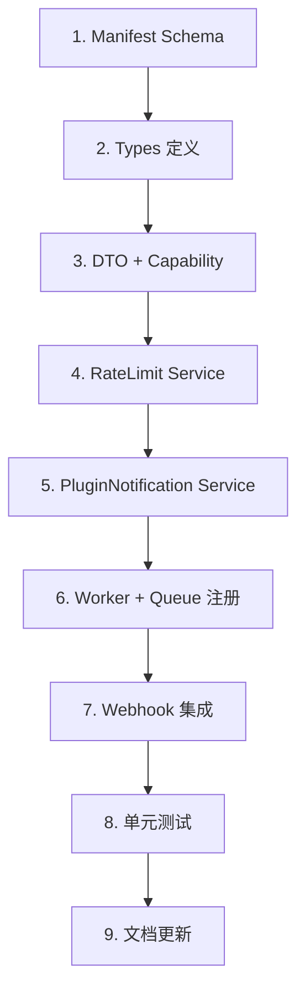

# Plugin Notification API 实现计划

**OpenSpec ID**: `plugin-notification-api`
**方案**: B（队列优先）
**预估工作量**: 3-4 天

---

## 1. 文件清单

### 新建文件
| 文件路径 | 职责 |
|---------|------|
| `apps/server/src/plugins/capabilities/notification.capability.ts` | 插件通知能力，验证 manifest/权限，入队 job |
| `apps/server/src/plugins/services/plugin-notification.service.ts` | 核心编排：类型验证、groupKey 生成、调用 NotificationService |
| `apps/server/src/plugins/services/plugin-rate-limit.service.ts` | 双层限流（插件级+用户级）+ 熔断器 |
| `apps/server/src/plugins/workers/plugin-notification.worker.ts` | 队列 worker，处理 plugin_notification job |
| `apps/server/src/plugins/dto/plugin-notification.dto.ts` | Job payload DTO/Zod schema |
| `apps/server/src/webhooks/notification-plugin-webhooks.ts` | Webhook 触发器，处理 clicked/archived 回调 |
| `apps/server/src/__tests__/plugins/plugin-notification.test.ts` | 单元测试 |

### 修改文件
| 文件路径 | 修改内容 |
|---------|----------|
| `packages/plugin/src/manifest.ts` | 添加 `notifications` 配置节 schema |
| `packages/plugin/src/types.ts` | 更新 `PluginNotificationCapability` 接口 |
| `apps/server/src/plugins/capabilities/index.ts` | 导出 notification capability |
| `apps/server/src/webhooks/webhook.event-handler.ts` | 注册 notification.clicked/archived 事件 |
| `apps/server/src/queue/queue.service.ts` | 注册 plugin_notification worker |
| `apps/server/src/notifications/notification.service.ts` | 添加 click/archive 事件触发 |

---

## 2. Manifest Schema 扩展

```typescript
// packages/plugin/src/manifest.ts

const aggregationStrategyEnum = z.enum(['none', 'by_target', 'by_actor', 'by_type']);

const notificationTypeSchema = z.object({
  id: z.string().min(1).regex(/^[a-z0-9_]+$/, 'type id must be lowercase alphanumeric'),
  category: z.enum(['system', 'collaboration', 'social']),
  aggregation: aggregationStrategyEnum.default('none'),
  i18n: z.record(
    z.string(), // locale key (e.g., 'en-US', 'zh-CN')
    z.object({
      title: z.string().min(1),
      description: z.string().optional(),
    })
  ),
});

const notificationWebhooksSchema = z.object({
  onClicked: z.string().url().optional(),
  onArchived: z.string().url().optional(),
}).optional();

const notificationRateLimitSchema = z.object({
  maxPerMinute: z.number().int().positive().max(10000).default(100),
  maxPerHour: z.number().int().positive().max(20000).default(1000),
  maxPerDay: z.number().int().positive().max(100000).default(10000),
}).partial();

const notificationsConfigSchema = z.object({
  types: z.array(notificationTypeSchema).min(1),
  permissions: z.array(z.enum([
    'notification:send',
    'notification:send:batch',
    'notification:read:own'
  ])).optional(),
  rateLimit: notificationRateLimitSchema.optional(),
  webhooks: notificationWebhooksSchema,
}).optional();

// 添加到 pluginManifestSchema
notifications: notificationsConfigSchema,
```

---

## 3. 类型定义

```typescript
// packages/plugin/src/types.ts

export interface PluginNotificationCapability {
  send(params: PluginNotificationSendParams): Promise<{ notificationId: string }>;
}

export interface PluginNotificationSendParams {
  type: string;           // 必须匹配 manifest.notifications.types.id
  userId: string;         // 目标用户
  actor?: {
    id: string;
    type: 'user' | 'plugin';
    name: string;
    avatarUrl?: string;
  };
  target: {
    type: string;
    id: string;
    url: string;
    previewImage?: string;
  };
  data?: Record<string, unknown>;  // 模板变量
  locale?: string;
}

export interface PluginRateLimitConfig {
  perPlugin: {
    maxPerMinute: number;   // 默认 100
    maxPerHour: number;     // 默认 1000
    maxPerDay: number;      // 默认 10000
  };
  perUser: {
    maxPerMinute: number;   // 默认 10
    maxPerHour: number;     // 默认 50
  };
  circuitBreaker: {
    failureThreshold: number;  // 连续失败次数
    cooldownSeconds: number;   // 熔断冷却时间
  };
}

export interface NotificationWebhookPayload {
  event: 'clicked' | 'archived';
  notificationId: string;
  userId: string;
  tenantId: string;
  type: string;
  target: { type: string; id: string; url?: string };
  timestamp: string;  // ISO 8601
}

export interface RateLimitResult {
  allowed: boolean;
  remaining: number;
  resetAt: string;      // ISO 8601
  retryAfter?: number;  // seconds
  reason?: 'RATE_LIMIT_EXCEEDED' | 'CIRCUIT_BREAKER_OPEN';
}
```

---

## 4. 核心服务设计

### 4.1 notification.capability.ts

```typescript
export function createPluginNotificationCapability(
  pluginId: string,
  manifest: PluginManifest,
  tenantId: string | undefined,
  queueService: QueueService
): PluginNotificationCapability {
  return {
    async send(params: PluginNotificationSendParams): Promise<{ notificationId: string }> {
      // 1. 验证 tenantId 存在
      if (!tenantId) {
        throw new Error('Cannot send notification without tenant context');
      }

      // 2. 验证权限声明
      const hasPermission = manifest.notifications?.permissions?.includes('notification:send');
      if (!hasPermission) {
        throw new PermissionDeniedError('notification:send');
      }

      // 3. 验证 type 在 manifest 中声明
      const typeDef = manifest.notifications?.types?.find(t => t.id === params.type);
      if (!typeDef) {
        throw new PluginNotificationValidationError(
          `Notification type '${params.type}' not declared in manifest`
        );
      }

      // 4. 入队 job（实际验证和创建在 worker 中）
      const jobId = await queueService.enqueue('core_plugin_notification', {
        pluginId,
        tenantId,
        userId: params.userId,
        type: params.type,
        actor: params.actor,
        target: params.target,
        data: params.data,
        locale: params.locale,
      });

      // 返回 jobId 作为 notificationId 占位（实际 ID 在 worker 中生成）
      return { notificationId: jobId };
    },
  };
}
```

### 4.2 plugin-notification.service.ts

```typescript
@Injectable()
export class PluginNotificationService {
  constructor(
    private readonly notificationService: NotificationService,
    private readonly pluginManager: PluginManager,
    private readonly eventBus: EventBus,
  ) {}

  // 验证类型定义
  validateType(pluginId: string, typeId: string): NotificationTypeDef {
    const manifest = this.pluginManager.getManifest(pluginId);
    const typeDef = manifest?.notifications?.types?.find(t => t.id === typeId);
    if (!typeDef) {
      throw new PluginNotificationValidationError(`Type '${typeId}' not found`);
    }
    return typeDef;
  }

  // 生成 groupKey
  buildGroupKey(
    pluginId: string,
    typeId: string,
    aggregation: AggregationStrategy,
    actor?: { id: string },
    target?: { type: string; id: string }
  ): string | undefined {
    if (aggregation === 'none') return undefined;

    const prefix = `plugin:${pluginId}:${typeId}`;
    switch (aggregation) {
      case 'by_target':
        return `${prefix}:target:${target?.type}:${target?.id}`;
      case 'by_actor':
        return `${prefix}:actor:${actor?.id}`;
      case 'by_type':
        return prefix;
      default:
        return undefined;
    }
  }

  // 创建通知
  async createNotification(payload: PluginNotificationJobPayload, typeDef: NotificationTypeDef) {
    const groupKey = this.buildGroupKey(
      payload.pluginId,
      payload.type,
      typeDef.aggregation,
      payload.actor,
      payload.target
    );

    const locale = payload.locale || 'en-US';
    const i18n = typeDef.i18n[locale] || typeDef.i18n['en-US'];

    return this.notificationService.createNotification({
      userId: payload.userId,
      tenantId: payload.tenantId,
      templateKey: `plugin:${payload.pluginId}:${payload.type}`,
      variables: payload.data || {},
      source: 'plugin',
      sourcePluginId: payload.pluginId,
      category: typeDef.category,
      aggregationStrategy: typeDef.aggregation,
      groupKey,
      actor: payload.actor ? {
        id: payload.actor.id,
        type: payload.actor.type,
        name: payload.actor.name,
        avatarUrl: payload.actor.avatarUrl,
      } : {
        id: payload.pluginId,
        type: 'plugin',
        name: payload.pluginId,
      },
      target: payload.target,
    });
  }
}
```

### 4.3 plugin-rate-limit.service.ts

```typescript
@Injectable()
export class PluginRateLimitService {
  private readonly DEFAULT_CONFIG: PluginRateLimitConfig = {
    perPlugin: { maxPerMinute: 100, maxPerHour: 1000, maxPerDay: 10000 },
    perUser: { maxPerMinute: 10, maxPerHour: 50 },
    circuitBreaker: { failureThreshold: 5, cooldownSeconds: 60 },
  };

  // 滑动窗口计数器 (Redis 实现)
  private counters: Map<string, { count: number; resetAt: number }> = new Map();
  private circuitBreakers: Map<string, { failures: number; openUntil: number }> = new Map();

  async checkAndConsume(
    pluginId: string,
    tenantId: string,
    userId: string,
    config?: Partial<PluginRateLimitConfig>
  ): Promise<RateLimitResult> {
    const limits = { ...this.DEFAULT_CONFIG, ...config };

    // 1. 检查熔断器
    const cb = this.circuitBreakers.get(pluginId);
    if (cb && Date.now() < cb.openUntil) {
      return {
        allowed: false,
        remaining: 0,
        resetAt: new Date(cb.openUntil).toISOString(),
        retryAfter: Math.ceil((cb.openUntil - Date.now()) / 1000),
        reason: 'CIRCUIT_BREAKER_OPEN',
      };
    }

    // 2. 检查插件级限流
    const pluginResult = this.checkWindow(`plugin:${pluginId}`, limits.perPlugin);
    if (!pluginResult.allowed) {
      return { ...pluginResult, reason: 'RATE_LIMIT_EXCEEDED' };
    }

    // 3. 检查用户级限流
    const userResult = this.checkWindow(
      `plugin:${pluginId}:user:${userId}`,
      limits.perUser
    );
    if (!userResult.allowed) {
      return { ...userResult, reason: 'RATE_LIMIT_EXCEEDED' };
    }

    // 4. 消费配额
    this.incrementCounter(`plugin:${pluginId}:minute`, 60000);
    this.incrementCounter(`plugin:${pluginId}:user:${userId}:minute`, 60000);

    return { allowed: true, remaining: pluginResult.remaining - 1, resetAt: pluginResult.resetAt };
  }

  recordFailure(pluginId: string): void {
    const cb = this.circuitBreakers.get(pluginId) || { failures: 0, openUntil: 0 };
    cb.failures++;
    if (cb.failures >= this.DEFAULT_CONFIG.circuitBreaker.failureThreshold) {
      cb.openUntil = Date.now() + this.DEFAULT_CONFIG.circuitBreaker.cooldownSeconds * 1000;
    }
    this.circuitBreakers.set(pluginId, cb);
  }

  recordSuccess(pluginId: string): void {
    this.circuitBreakers.delete(pluginId);
  }

  // ... 内部辅助方法
}
```

### 4.4 plugin-notification.worker.ts

```typescript
@Injectable()
export class PluginNotificationWorker implements OnModuleInit {
  constructor(
    private readonly queueService: QueueService,
    private readonly pluginNotificationService: PluginNotificationService,
    private readonly rateLimitService: PluginRateLimitService,
    private readonly pluginManager: PluginManager,
  ) {}

  onModuleInit() {
    this.queueService.registerHandler('core_plugin_notification', this.handleJob.bind(this));
  }

  async handleJob(data: PluginNotificationJobPayload, job: Job): Promise<string> {
    const { pluginId, tenantId, userId, type } = data;

    // 1. 验证插件启用状态
    const plugin = await this.pluginManager.getPlugin(pluginId);
    if (!plugin || plugin.status !== 'enabled') {
      throw new FatalJobError(`Plugin ${pluginId} not enabled`);
    }

    // 2. 验证类型定义
    const typeDef = this.pluginNotificationService.validateType(pluginId, type);

    // 3. 限流检查
    const rateLimitResult = await this.rateLimitService.checkAndConsume(
      pluginId,
      tenantId,
      userId,
      plugin.manifest.notifications?.rateLimit
    );
    if (!rateLimitResult.allowed) {
      throw new RateLimitExceededError(pluginId, rateLimitResult);
    }

    // 4. 创建通知
    try {
      const result = await this.pluginNotificationService.createNotification(data, typeDef);
      this.rateLimitService.recordSuccess(pluginId);
      return result.notification.id;
    } catch (error) {
      this.rateLimitService.recordFailure(pluginId);
      throw error;
    }
  }
}
```

---

## 5. Webhook 集成

### 5.1 notification-plugin-webhooks.ts

```typescript
@Injectable()
export class NotificationPluginWebhooks {
  constructor(
    private readonly pluginManager: PluginManager,
    private readonly webhookDispatcher: WebhookDispatcher,
  ) {}

  async triggerWebhook(
    event: 'clicked' | 'archived',
    notification: Notification
  ): Promise<void> {
    // 仅处理插件通知
    if (notification.source !== 'plugin' || !notification.sourcePluginId) {
      return;
    }

    const manifest = await this.pluginManager.getManifest(notification.sourcePluginId);
    const webhookUrl = event === 'clicked'
      ? manifest?.notifications?.webhooks?.onClicked
      : manifest?.notifications?.webhooks?.onArchived;

    if (!webhookUrl) return;

    const payload: NotificationWebhookPayload = {
      event,
      notificationId: notification.id,
      userId: notification.userId,
      tenantId: notification.tenantId,
      type: notification.templateKey?.replace(`plugin:${notification.sourcePluginId}:`, '') || '',
      target: notification.target as { type: string; id: string; url?: string },
      timestamp: new Date().toISOString(),
    };

    // 使用现有 webhook 系统发送
    await this.webhookDispatcher.enqueuePluginWebhook(
      notification.sourcePluginId,
      webhookUrl,
      payload
    );
  }
}
```

### 5.2 事件注册 (webhook.event-handler.ts)

```typescript
// 添加到 onModuleInit
this.eventBus.on('notification.clicked', (event) =>
  this.notificationPluginWebhooks.triggerWebhook('clicked', event.notification)
);
this.eventBus.on('notification.archived', (event) =>
  this.notificationPluginWebhooks.triggerWebhook('archived', event.notification)
);
```

---

## 6. 错误处理

| 错误类型 | 错误码 | 响应格式 |
|---------|--------|----------|
| 限流超限 | `RATE_LIMIT_EXCEEDED` | `{ error, retryAfter, limit: { remaining, resetAt } }` |
| 熔断开启 | `CIRCUIT_BREAKER_OPEN` | `{ error, retryAfter, reason }` |
| 类型未声明 | `NOTIFICATION_TYPE_NOT_DECLARED` | `{ error, message, pluginId, type }` |
| 权限拒绝 | `PERMISSION_DENIED` | `{ error, permission: 'notification:send' }` |
| 插件未启用 | `PLUGIN_NOT_ENABLED` | `{ error, pluginId }` |

---

## 7. 实现顺序



| 步骤 | 任务 | 依赖 |
|------|------|------|
| 1 | 扩展 manifest.ts 添加 notifications schema | - |
| 2 | 更新 types.ts 添加接口定义 | 步骤 1 |
| 3 | 创建 DTO + notification.capability.ts | 步骤 2 |
| 4 | 实现 plugin-rate-limit.service.ts | - |
| 5 | 实现 plugin-notification.service.ts | 步骤 1, 4 |
| 6 | 实现 plugin-notification.worker.ts + 注册 | 步骤 3, 4, 5 |
| 7 | 实现 webhook 集成 + 事件触发 | 步骤 6 |
| 8 | 编写单元测试 | 步骤 7 |
| 9 | 更新 OpenSpec tasks + 开发文档 | 步骤 8 |

---

## 8. 验收标准

- [ ] Manifest 新增 notifications 配置可正常解析验证
- [ ] 插件调用 send() 成功创建通知
- [ ] 类型未声明时抛出验证错误
- [ ] 超过限流阈值时返回 retryAfter
- [ ] 连续失败触发熔断
- [ ] 点击/归档通知触发 webhook 回调
- [ ] 所有测试用例通过
