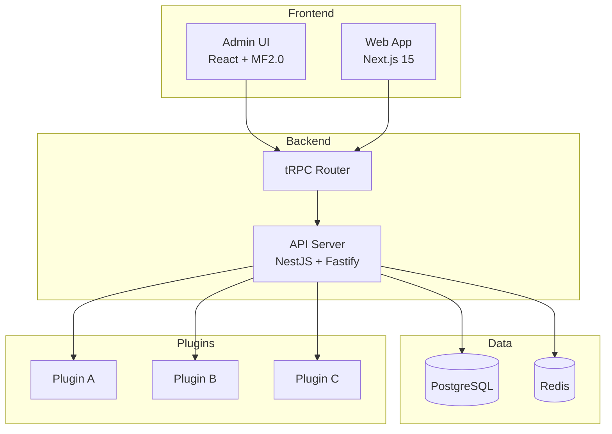
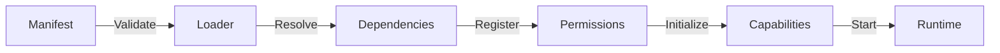
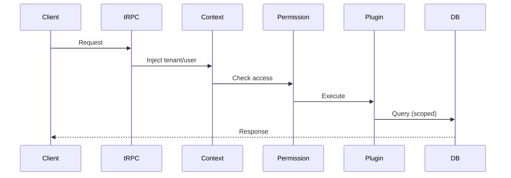

# WordRhyme Architecture

## System Overview

## Core Components

### Kernel

The kernel manages system lifecycle:
- **Booting**: Load config, initialize context providers
- **Running**: Accept requests, manage plugins
- **Reloading**: Hot reload plugins (v1.0)

### Context Providers

Each request has isolated context:
- `TenantContextProvider` - Multi-tenancy
- `UserContextProvider` - Authentication
- `LocaleContextProvider` - i18n
- `TimezoneContextProvider` - Time handling

### Plugin System

## Data Flow

## Multi-Tenancy

All data is scoped by `tenant_id`:
- Automatic filtering on queries
- Enforced at capability layer
- No cross-tenant data leakage

## Module Federation

Admin UI loads plugin UIs dynamically:
1. Host exposes shared dependencies
2. Plugins expose RemoteEntry.js
3. Runtime loads and registers extensions
