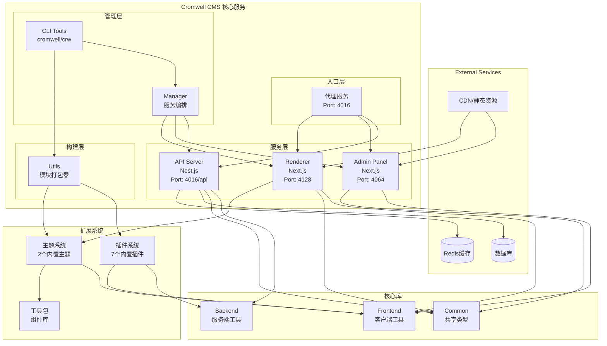
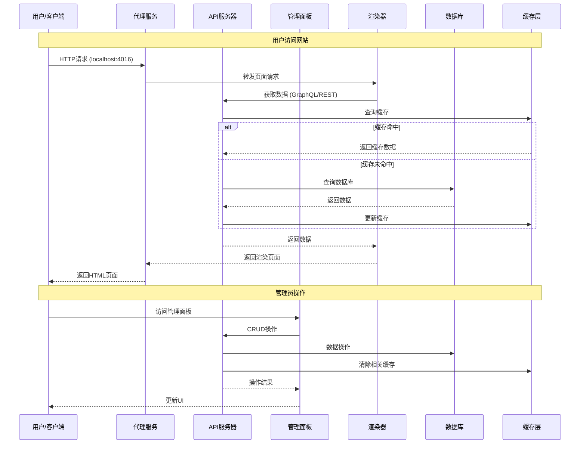
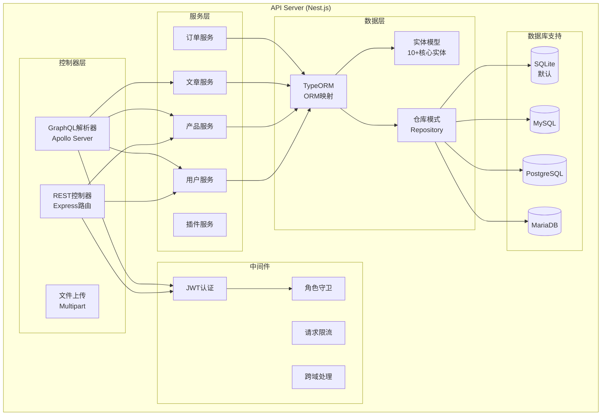
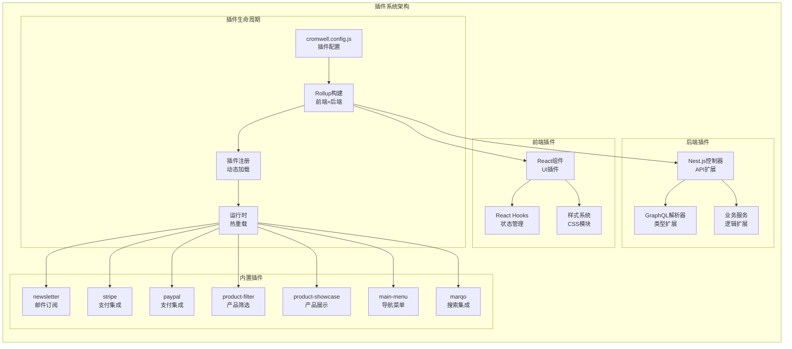
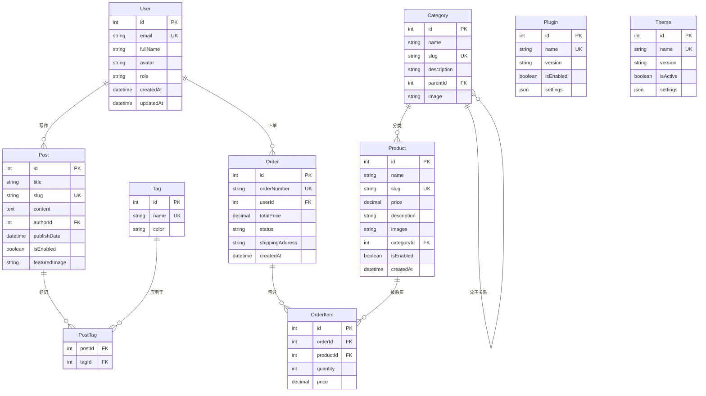
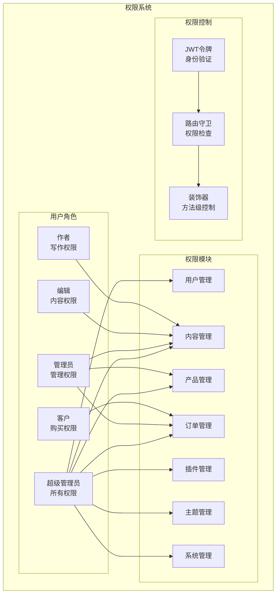
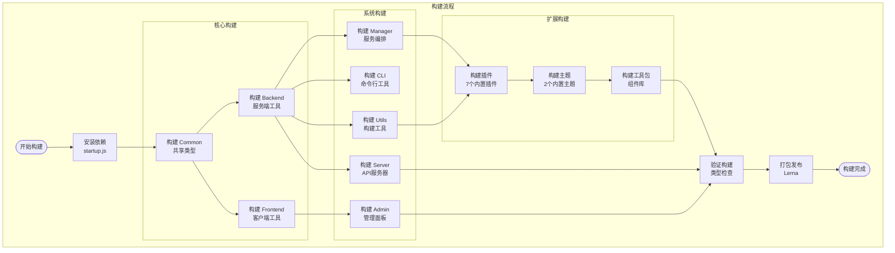
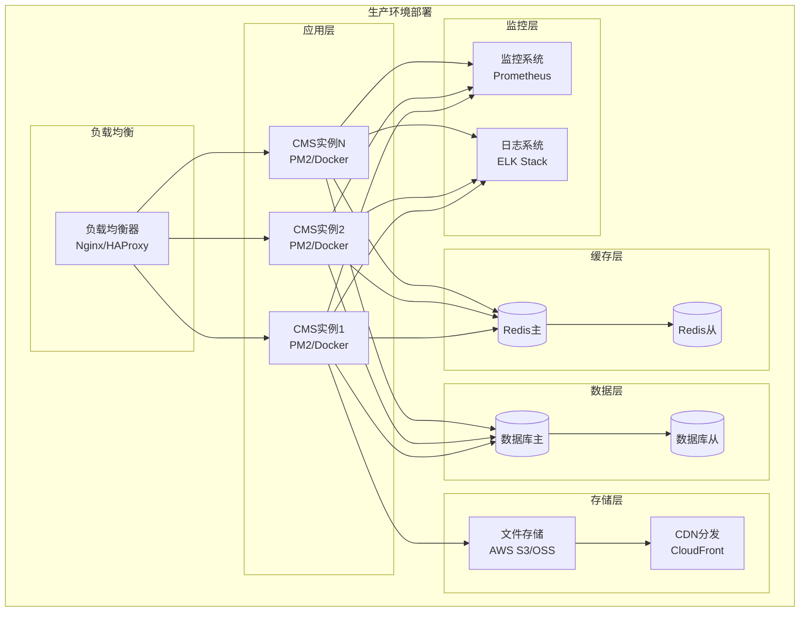
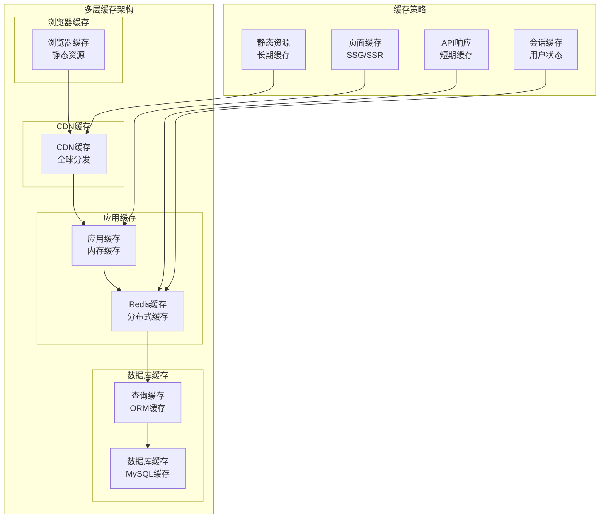
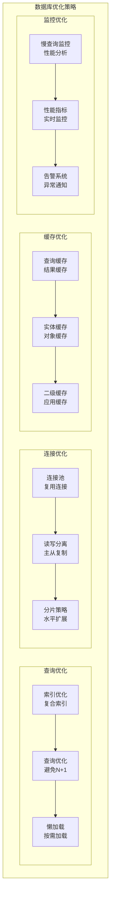

# Cromwell CMS 架构文档

## 1. 整体系统架构

### 1.1 系统架构图



### 1.2 数据流架构



## 2. 服务详细架构

### 2.1 API服务器架构



### 2.2 插件系统架构



### 2.3 主题系统架构

```mermaid
graph TB
    subgraph "主题系统"
        subgraph "主题结构"
            ThemeConfig[cromwell.config.js<br/>主题配置]
            NextjsApp[Next.js应用<br/>完整网站]
            Pages[页面路由<br/>动态路由]
            Components[React组件<br/>可复用组件]
        end
        
        subgraph "集成功能"
            PluginEmbed[插件嵌入<br/>插件集成]
            VisualEditor[可视化编辑<br/>实时预览]
            SEO[SEO优化<br/>元数据管理]
            Styling[样式系统<br/>全局CSS]
        end
        
        subgraph "内置主题"
            StoreTheme[theme-store<br/>电商主题]
            BlogTheme[theme-blog<br/>博客主题]
        end
        
        subgraph "路由页面"
            HomePage[首页 /]
            CategoryPage[分类页 /category/[slug]]
            ProductPage[产品页 /product/[slug]]
            PostPage[文章页 /post/[slug]]
            CheckoutPage[结账页 /checkout]
        end
        
        subgraph "工具包集成"
            CommerceToolkit[商务工具包<br/>电商组件]
            UIComponents[UI组件<br/>通用组件]
        end
    end
    
    %% 连接关系
    ThemeConfig --> NextjsApp
    NextjsApp --> Pages
    Pages --> Components
    
    Components --> PluginEmbed
    Components --> VisualEditor
    Components --> SEO
    Components --> Styling
    
    NextjsApp --> StoreTheme
    NextjsApp --> BlogTheme
    
    Pages --> HomePage
    Pages --> CategoryPage
    Pages --> ProductPage
    Pages --> PostPage
    Pages --> CheckoutPage
    
    Components --> CommerceToolkit
    Components --> UIComponents
```

## 3. 数据模型架构

### 3.1 核心实体关系图



### 3.2 权限系统架构



## 4. 构建与部署架构

### 4.1 构建流程图



### 4.2 部署架构图



## 5. 性能优化架构

### 5.1 缓存策略



### 5.2 数据库优化



这些架构图和流程图提供了 Cromwell CMS 系统的全面视图，包括系统架构、数据流、服务详情、数据模型、构建部署和性能优化等方面的详细说明。