# WordRhyme Authorization & Permission System

## Architecture Overview

WordRhyme implements a **4-layer hybrid permission model**: RBAC + ABAC + LBAC + Field-level control, built on the CASL framework.

```
Frontend (advisory only)       <- ability.tsx, useCrudPermissions
tRPC Middleware                <- protectedProcedure + globalPermissionMiddleware
Permission Kernel (RBAC)       <- centralized decision engine, deny by default
ScopedDb (ABAC/LBAC/Field)     <- auto SQL filter injection
Database                       <- roles, rolePermissions, tenant isolation
```

---

## Permission Flow Diagram

```mermaid
flowchart TD
    subgraph Frontend["Frontend (Advisory Only)"]
        A[User Request] --> B[AbilityProvider<br/>trpc.permissions.myRules]
        B --> C{useCan / useCrudPermissions<br/>UI Permission Check}
        C -->|can = false| D[Hide Button/Column<br/>Not trustworthy, bypassable]
        C -->|can = true| E[Send tRPC Request<br/>trpc.employees.update.mutate]
    end

    subgraph TRPC["tRPC Middleware Layer"]
        E --> F[protectedProcedure]
        F --> G{Authentication<br/>ctx.userId exists?}
        G -->|No| H[401 UNAUTHORIZED]
        G -->|Yes| I[globalPermissionMiddleware<br/>Read .meta permission]
        I --> J{meta.permission<br/>exists?}
        J -->|No| K[Skip permission check<br/>Execute directly]
        J -->|Yes| L[Call PermissionKernel.require<br/>action + subject]
    end

    subgraph Kernel["Permission Kernel - Centralized Decision"]
        L --> M{L1 Cache Hit?<br/>per-request Map}
        M -->|Hit| O{Result}
        M -->|Miss| N{L2 Cache Hit?<br/>Redis PermissionCache}
        N -->|Hit| O
        N -->|Miss| P[loadRulesFromDB<br/>rawDb query to avoid recursion]

        subgraph RuleLoad["Rule Loading"]
            P --> P1[Query roles table<br/>WHERE slug IN roleNames<br/>AND organizationId = orgId]
            P1 --> P2[Query rolePermissions table<br/>WHERE roleId IN roleIds]
            P2 --> P3[interpolateConditions<br/>Replace template vars e.g. user.id]
            P3 --> P4[createMongoAbility<br/>manage expands to all CRUD]
        end

        P4 --> O
        O -->|Denied| Q[403 FORBIDDEN<br/>Audit log: always recorded]
        O -->|Allowed| R[RBAC Passed]
        R --> R1{Sensitive operation?<br/>manage User / delete Org}
        R1 -->|Yes| R2[Audit log: record allowed]
        R1 -->|No| S[Store in AsyncLocalStorage<br/>permissionMeta = action + subject]
        R2 --> S
    end

    subgraph Handler["Procedure Handler"]
        S --> T[Business logic execution<br/>db.update employees .set input]
        K --> T
    end

    subgraph ScopedDb["ScopedDb - Auto Security Filtering"]
        T --> U[Read permissionMeta<br/>from AsyncLocalStorage]

        U --> V1["1. Tenant Isolation<br/>AND organization_id = current_org"]

        V1 --> V2["2. LBAC Tag Filtering"]
        subgraph LBAC["LBAC Filtering"]
            V2 --> V2a["ACL Allow<br/>AND acl_tags && user_keys"]
            V2a --> V2b["Deny Reject<br/>AND NOT deny_tags && user_keys"]
        end

        V2b --> V3["3. ABAC Condition Injection"]
        subgraph ABAC["ABAC Execution Strategy"]
            V3 --> V3a{ABAC conditions<br/>convertible to SQL?}
            V3a -->|Yes| V3b["SQL Pushdown<br/>Single query<br/>can rules OR merged<br/>cannot rules AND NOT"]
            V3a -->|No| V3c["Double query fallback<br/>1. Query instances<br/>2. In-memory CASL check<br/>3. Filter allowed IDs<br/>4. Execute operation"]
        end

        V3b --> V4["4. Field Filtering"]
        V3c --> V4
        subgraph FieldFilter["Field-Level Control"]
            V4 --> V4a[permissionKernel.permittedFields]
            V4a --> V4b{Field restrictions?}
            V4b -->|Yes| V4c[Remove unauthorized fields<br/>deny: salary, ssn]
            V4b -->|No| V4d[Return all fields]
        end
    end

    subgraph DB["Database"]
        V4c --> W["Final SQL Execution<br/>UPDATE employees SET name = 'John'<br/>WHERE id = '123'<br/>AND organization_id = 'org-1'<br/>AND acl_tags && user_keys<br/>AND NOT deny_tags && user_keys<br/>AND owner_id = 'user-123'"]
        V4d --> W
        W --> X[Return Result]
    end

    X --> Y[Response to Frontend]

    style Frontend fill:#e3f2fd,stroke:#1565c0,color:#000
    style TRPC fill:#fff3e0,stroke:#e65100,color:#000
    style Kernel fill:#fce4ec,stroke:#c62828,color:#000
    style ScopedDb fill:#e8f5e9,stroke:#2e7d32,color:#000
    style DB fill:#f3e5f5,stroke:#6a1b9a,color:#000
    style RuleLoad fill:#fff8e1,stroke:#f9a825,color:#000
    style LBAC fill:#e0f2f1,stroke:#00695c,color:#000
    style ABAC fill:#e8eaf6,stroke:#283593,color:#000
    style FieldFilter fill:#fbe9e7,stroke:#bf360c,color:#000
    style H fill:#ffcdd2,stroke:#c62828,color:#000
    style Q fill:#ffcdd2,stroke:#c62828,color:#000
    style D fill:#fff9c4,stroke:#f57f17,color:#000
```



### Layer Legend

| Color | Layer | Security Level |
|-------|-------|----------------|
| Blue | Frontend | Not trustworthy, UI optimization only |
| Orange | tRPC Middleware | Auth + RBAC entry point |
| Red | Permission Kernel | Single decision authority |
| Green | ScopedDb | ABAC/LBAC/Field enforcement |
| Purple | Database | Final SQL security boundary |

---

## Detailed Component Analysis

### 1. Permission Kernel — Centralized Decision Engine

**File**: `apps/server/src/permission/permission-kernel.ts`

The kernel is the **single source of truth** for all permission decisions, implementing a deny-by-default model.

#### Key Methods

- **`can(action, subject, instance?)`** — Permission check, returns boolean
  1. Check user existence
  2. Parse capability format (supports legacy `content:read:space` and CASL `read, Content`)
  3. Check L1 cache (per-request Map) -> L2 cache (Redis)
  4. Create CASL ability -> execute check
  5. Cache result + audit log

- **`require(action, subject)`** — Throws `PermissionDeniedError` on denial

- **`permittedFields(action, subject)`** — Returns list of allowed fields

#### Two-Level Cache

```
L1: Map<string, CacheEntry>   <- per-request in-memory cache
L2: PermissionCache (Redis)    <- cross-request cache
```

#### Audit Logging

- **Denied access**: Always recorded
- **Sensitive operations** (`manage User`, `delete Organization`, etc.): Recorded even when allowed

---

### 2. Data Model

#### roles table

| Column | Description |
|--------|-------------|
| `id` | Primary key |
| `slug` | Role identifier: `owner`, `admin`, `member` |
| `name` | Display name |
| `organizationId` | Tenant isolation |

#### rolePermissions table — CASL Rule Storage

| Column | Description |
|--------|-------------|
| `roleId` | FK to roles |
| `action` | `read / create / update / delete / manage` |
| `subject` | `Content / User / Menu / plugin:notification` etc. |
| `fields` | Field restrictions: `['name', 'email']` |
| `conditions` | ABAC conditions (JSONB): `{ ownerId: "${user.id}" }` |
| `inverted` | `true` = "cannot" rule |

---

### 3. End-to-End Permission Flow

#### Step 1: tRPC Middleware (RBAC)

**File**: `apps/server/src/trpc/trpc.ts` (Lines 183-238)

```typescript
// protectedProcedure chain:
// 1. Authentication check (ctx.userId exists?)
// 2. globalPermissionMiddleware reads .meta({ permission })
// 3. Calls permissionKernel.require(action, subject)
// 4. Stores permissionMeta in AsyncLocalStorage
```

Usage:

```typescript
update: protectedProcedure
  .input(updateInput)
  .meta({ permission: { action: 'update', subject: 'Employee' } })
  .mutation(async ({ input }) => {
    // Authentication checked
    // RBAC checked
    // DB operations auto-apply ABAC + field filtering
  });
```

#### Step 2: CASL Rule Loading

**File**: `apps/server/src/permission/casl-ability.ts`

```
loadRulesFromDB(roleNames, orgId)
  -> Query roles (WHERE slug IN roleNames AND organizationId = orgId)
  -> Query rolePermissions (WHERE roleId IN roleIds)
  -> interpolateConditions: { ownerId: "${user.id}" } -> { ownerId: "actual-id" }
  -> createMongoAbility(rules): 'manage' expands to all CRUD actions
```

**Important**: Uses `rawDb` (not ScopedDb) to avoid infinite recursion during permission loading.

#### Step 3: ScopedDb (ABAC/LBAC/Field Filtering)

**File**: `apps/server/src/db/scoped-db.ts`

ScopedDb wraps Drizzle ORM and auto-injects security filters on all queries:

**Tenant Isolation** (always applied):
```sql
AND organization_id = 'current-org'
```

**LBAC Tag Filtering**:
```sql
AND (acl_tags && user_keys)          -- ACL allow
AND NOT (deny_tags && user_keys)     -- Deny reject
```

**ABAC Condition Injection** (two strategies):
- **SQL Pushdown** (preferred): Convert ABAC conditions to SQL WHERE clause for single-query execution
  - `can` rules: OR merged
  - `cannot` rules: AND NOT excluded
- **Double Query Fallback**: Query instances -> in-memory CASL check -> filter IDs -> execute

**Field Filtering**:
```
permissionKernel.permittedFields(action, subject)
  -> Has restrictions? Remove unauthorized fields
  -> Check failed? Throw error (deny by default, never return unfiltered data)
```

---

### 4. Frontend Permission System

#### AbilityProvider

**File**: `apps/admin/src/lib/ability.tsx`

```
User login -> trpc.permissions.myRules.useQuery()
           -> Fetch CASL rules from backend
           -> createMongoAbility(rules)
           -> Distribute via Context to all child components
```

5-minute staleTime cache, refreshes on window focus.

#### useCrudPermissions Hook

**File**: `apps/admin/src/hooks/use-crud-permissions.ts`

```typescript
useCrudPermissions('Employee', schema) -> {
  can: {
    create: ability.can('create', 'Employee'),
    update: ability.can('update', 'Employee'),
    delete: ability.can('delete', 'Employee'),
    export: ability.can('read', 'Employee'),
  },
  deny: ['salary', 'ssn'],  // All fields - allowed fields = hidden fields
}
```

**Security boundary**: Frontend permissions are for UI optimization only (hiding buttons/columns). **Real security is enforced by backend ScopedDb + PermissionKernel.**

---

### 5. Resource Definitions

**File**: `apps/server/src/permission/resource-definitions.ts`

`RESOURCE_DEFINITIONS` is the **single source of truth** for permission metadata, defining 30+ resources:

```typescript
Member: {
  subject: 'Member',
  actions: ['create', 'read', 'update', 'delete'],
  availablePresets: ['none', 'own', 'team', 'department'],  // ABAC presets
  availableFields: [
    { name: 'email', label: 'Email', sensitive: true },
  ],
  menuPath: '/members',
  parentCode: 'core:team',  // Menu hierarchy
}
```

Supports `getResourceTree()` for generating tree structures used in permission configuration UI.

---

### 6. Plugin Permissions

Plugins use the `plugin:` namespace prefix, following the same RBAC flow:

```json
{ "action": "read", "subject": "plugin:notification" }
```

Core principle: **Plugins cannot self-authorize.** All permissions are decided by the centralized PermissionKernel.

---

## Security Guarantees

| Layer | Responsibility | Trustworthy |
|-------|---------------|-------------|
| Frontend `useCrudPermissions` | UI optimization (button/column visibility) | No |
| tRPC `globalPermissionMiddleware` | RBAC check | Yes |
| `PermissionKernel` | Single permission authority | Yes |
| `ScopedDb` | ABAC/LBAC/Field/Tenant enforcement | Yes |

## Performance Optimizations

- **L1 Cache**: Per-request in-memory ability cache (Map)
- **L2 Cache**: Redis-backed cross-request permission cache
- **SQL Pushdown**: ABAC conditions converted to WHERE clauses when possible
- **Request-level LBAC Key Caching**: User keys computed once per request

## Key Source Files

| File | Lines | Description |
|------|-------|-------------|
| `apps/server/src/permission/permission-kernel.ts` | ~544 | Central decision engine |
| `apps/server/src/permission/casl-ability.ts` | ~277 | CASL integration |
| `apps/server/src/db/scoped-db.ts` | ~1995 | Auto ABAC/LBAC/field filtering |
| `apps/server/src/trpc/trpc.ts` | ~406 | tRPC middleware |
| `apps/server/src/permission/resource-definitions.ts` | ~878 | Resource metadata |
| `apps/admin/src/lib/ability.tsx` | ~177 | Frontend CASL provider |
| `apps/admin/src/hooks/use-crud-permissions.ts` | ~75 | Field filtering hook |

---

**Core Principle**: Frontend can hide, backend must enforce.
