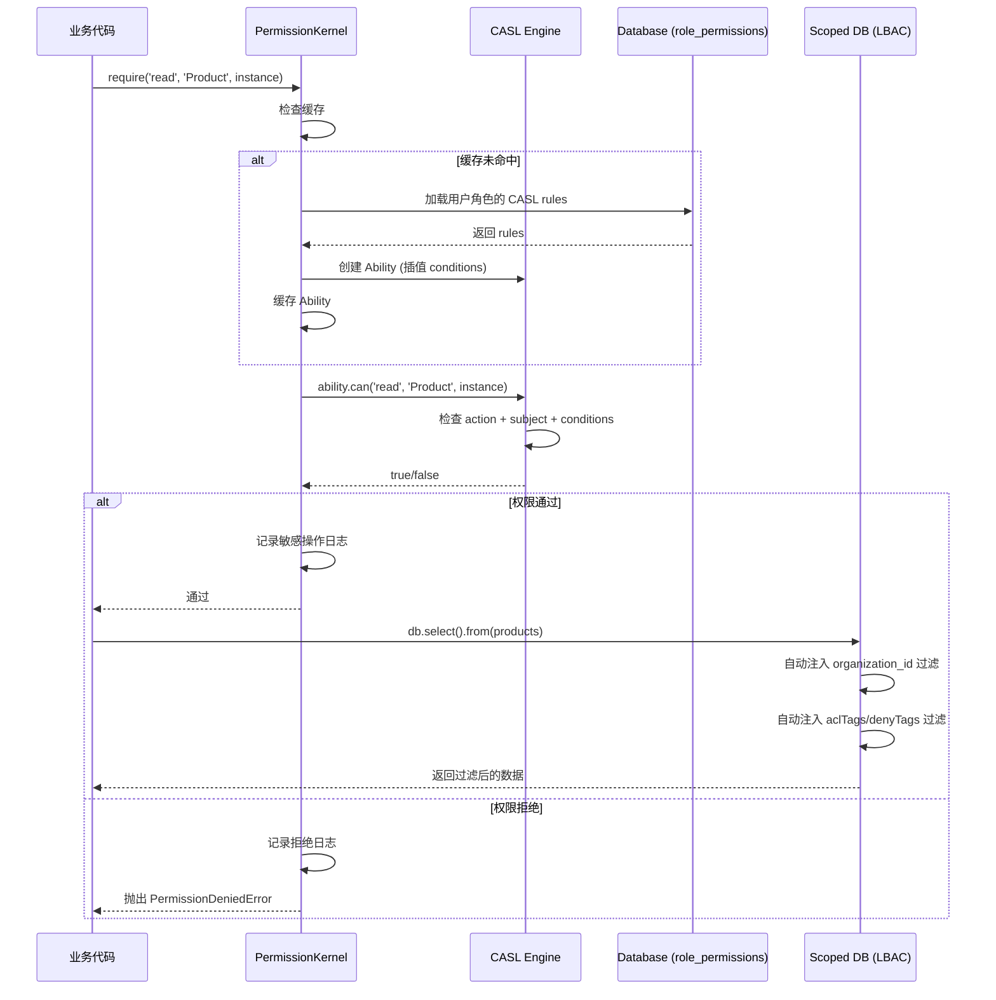

# WordRhyme 权限系统完整分析

## 系统架构概览

WordRhyme 采用 **CASL (RBAC + ABAC + 字段级控制) + LBAC** 混合权限模型：

```
┌─────────────────────────────────────────────────────────────┐
│                   Permission Kernel                         │
│         (Centralized White-List Authorization)              │
└─────────────────────────────────────────────────────────────┘
         │                      │                     │
         ▼                      ▼                     ▼
┌───────────────┐    ┌───────────────────┐   ┌──────────────┐
│  CASL Engine  │    │   Field Guard     │   │  Scoped DB   │
│ (RBAC + ABAC) │    │ (Field-Level)     │   │   (LBAC)     │
└───────────────┘    └───────────────────┘   └──────────────┘
         │                      │                     │
         └──────────────────────┴─────────────────────┘
                                │
                    ┌───────────▼────────────┐
                    │  Database (PostgreSQL) │
                    │  - role_permissions    │
                    │  - aclTags/denyTags    │
                    └────────────────────────┘
```

---

## 1. RBAC (Role-Based Access Control)

### 核心组件
- **PermissionKernel**: 权限评估中心 (`permission-kernel.ts`)
- **CASL Ability**: 基于 `@casl/ability` 的权限引擎
- **数据库驱动**: `role_permissions` 表存储规则

### 权限格式

```typescript
// CASL Rule 存储在 role_permissions 表
interface CaslRule {
  action: string;       // 'read', 'create', 'update', 'delete', 'manage'
  subject: string;      // 'User', 'Order', 'Product', 'plugin:pluginId:resource'
  fields?: string[];    // 字段级限制 ['name', 'email']
  conditions?: object;  // ABAC 条件 { "ownerId": "${user.id}" }
  inverted?: boolean;   // true = cannot (拒绝规则)
}
```

### Subject 命名规范

```typescript
// 核心资源
'User', 'Organization', 'Team', 'Content', 'Menu', 'Plugin', 'Role'

// 插件资源 (capability-parser.ts:111-131)
'plugin:{pluginId}'                    // 插件本身
'plugin:{pluginId}:{resource}'         // 插件资源
'plugin:{pluginId}:{resource}.{action}' // 自动解析为 action + subject

// 示例
'plugin:com.wordrhyme.dsuni:products'
'plugin:com.wordrhyme.dsuni:orders'
```

### Permission Key 转换

```typescript
// definePlugin 中权限定义
permissions: {
  products: {
    view: '查看产品',
    create: '创建产品',
  },
}

// 自动转换为 CASL subject
// 插件权限完整格式: pluginId.group.action
'com.wordrhyme.dsuni.products.view'   // 完整 key
  ↓ 解析为
action: 'view'
subject: 'plugin:com.wordrhyme.dsuni:products'
```

### 关键 API

```typescript
// permission-kernel.ts

// 检查权限
await permissionKernel.can('read', 'Product')              // CASL 格式
await permissionKernel.can('plugin:com.wordrhyme.dsuni:products.view')  // Legacy 格式

// 要求权限（抛出异常）
await permissionKernel.require('read', 'Product')

// 获取允许的字段
const fields = await permissionKernel.permittedFields('read', 'Product')
// Returns: ['id', 'name', 'price'] or undefined (all fields)
```

---

## 2. ABAC (Attribute-Based Access Control)

### 条件插值 (Condition Interpolation)

CASL 支持动态条件，允许基于用户属性的访问控制：

```typescript
// casl-ability.ts:73-108
// 数据库中的规则
{
  action: 'update',
  subject: 'Order',
  conditions: {
    "ownerId": "${user.id}",              // 只能修改自己的订单
    "status": { "$in": ["pending", "paid"] }  // 只能修改特定状态
  }
}

// 运行时插值
const user = { id: 'user-123', organizationId: 'org-456' };
// conditions 变为: { "ownerId": "user-123", "status": { "$in": [...] } }
```

### ABAC 检查方式

```typescript
// permission-kernel.ts:161-168
// 带 subject instance 的检查
const order = { id: '1', ownerId: 'user-123', status: 'pending' };
const canUpdate = await permissionKernel.can('update', 'Order', order);
// CASL 会检查 conditions 是否匹配 order 对象
```

### 使用场景

```typescript
// 订单权限示例
{
  action: 'read',
  subject: 'Order',
  conditions: {
    "$or": [
      { "ownerId": "${user.id}" },           // 自己的订单
      { "assignedTo": "${user.id}" },        // 分配给自己的
      { "teamId": "${user.currentTeamId}" }  // 团队订单
    ]
  }
}
```

---

## 3. 字段级控制 (Field-Level Control)

### FieldGuard 服务

```typescript
// field-guard.ts

// 注册字段规则
fieldGuard.register({
  entity: 'User',
  rules: [
    { field: 'email', rule: FieldRules.any(
        FieldRules.ownerOnly('id'),  // 本人
        FieldRules.adminOnly()       // 管理员
    )},
    { field: 'password', rule: FieldRules.never() },  // 永远不可见
    { field: 'banReason', rule: FieldRules.adminOnly() },
  ],
  defaultVisible: true  // 未列出的字段默认可见
});

// 使用
const sanitized = fieldGuard.scrub('User', userData, userKeys);
// 自动移除用户无权查看的字段
```

### CASL 字段限制

```typescript
// role_permissions 表中的 fields 字段
{
  action: 'read',
  subject: 'Product',
  fields: ['id', 'name', 'price']  // 只能看这些字段
}

// 检查
const allowedFields = await permissionKernel.permittedFields('read', 'Product');
// Returns: ['id', 'name', 'price']
```

### 两种字段控制对比

| 机制 | 存储位置 | 适用场景 | 动态性 |
|------|---------|---------|--------|
| **CASL fields** | role_permissions 表 | 基于角色的静态限制 | 低（需DB更新） |
| **FieldGuard rules** | 代码注册 | 基于上下文的动态限制 | 高（运行时计算） |

---

## 4. LBAC (Label-Based Access Control)

### Scoped DB 实现

```typescript
// scoped-db.ts:160-189
// 自动注入过滤

// 1️⃣ Organization 过滤 (tenant_id)
if (schema.hasOrganizationId && organizationId) {
  filters.push(eq(schema.organizationIdColumn, organizationId));
}

// 2️⃣ LBAC 标签过滤 (aclTags/denyTags)
if (schema.hasAclTags && userKeys.length > 0) {
  const allowFilter = sql`(${schema.aclTagsColumn} && ${keysArray})`;
  const denyFilter = sql`NOT (${schema.denyTagsColumn} && ${keysArray})`;
  filters.push(and(allowFilter, denyFilter)!);
} else if (schema.hasAclTags) {
  filters.push(sql`FALSE`);  // 没有 keys = 无权限
}
```

### 标签格式

```typescript
// permission-fields.ts
const lbacFields = {
  aclTags: text('acl_tags').array().notNull().default([]),
  denyTags: text('deny_tags').array().notNull().default([]),
};

// 用户的 access keys 格式
const userKeys = [
  'user:{userId}',
  'org:{organizationId}',
  'team:{teamId}',
  'role:admin',
  'role:editor',
];
```

### LBAC 应用场景

```typescript
// 产品可见性控制
{
  id: 'prod-1',
  organization_id: 'org-123',
  aclTags: ['org:org-123', 'team:team-456'],  // 组织和团队可见
  denyTags: ['user:blacklist-user'],           // 黑名单用户不可见
}

// 查询时自动过滤
const products = await ctx.db.select().from(products);
// WHERE organization_id = 'org-123'
//   AND acl_tags && ARRAY['org:org-123', 'team:team-456', ...]
//   AND NOT (deny_tags && ARRAY[...])
```

---

## 5. 权限检查流程

### 完整检查链



### 层级关系

```
Level 1: RBAC + ABAC (PermissionKernel + CASL)
  ↓ 决定：用户能否执行某个操作
  ↓
Level 2: Field-Level Control (FieldGuard + CASL fields)
  ↓ 决定：用户能看到哪些字段
  ↓
Level 3: Row-Level Control (Scoped DB + LBAC)
  ↓ 决定：用户能访问哪些数据行
  ↓
Result: 最终返回给用户的数据
```

---

## 6. 插件权限集成

### 插件权限注册

```typescript
// 插件安装时注册权限到 role_permissions
export const { manifest, PERMISSIONS } = definePlugin({
  pluginId: 'com.wordrhyme.dsuni',
  permissions: {
    products: {
      view: '查看产品',
      create: '创建产品',
      update: '更新产品',
      delete: '删除产品',
    },
  },
});

// 自动生成 manifest.json
{
  "permissions": {
    "definitions": [
      { "key": "com.wordrhyme.dsuni.products.view", "description": "查看产品" },
      { "key": "com.wordrhyme.dsuni.products.create", "description": "创建产品" },
      ...
    ]
  }
}

// 安装时写入 role_permissions (假设分配给 admin 角色)
INSERT INTO role_permissions (role_id, action, subject, source) VALUES
  ('admin-role-id', 'view', 'plugin:com.wordrhyme.dsuni:products', 'com.wordrhyme.dsuni'),
  ('admin-role-id', 'create', 'plugin:com.wordrhyme.dsuni:products', 'com.wordrhyme.dsuni'),
  ...
```

### 插件使用权限

```typescript
// src/routers/products.ts
import { PERMISSIONS } from '../../manifest';

export const productsRouter = router({
  list: pluginProcedure
    .meta({ permission: PERMISSIONS.products.view })
    //                   ^^^^^^^^^^^^^^^^^^^^^^^^
    //                   'com.wordrhyme.dsuni.products.view'
    .query(async ({ ctx }) => {
      // Global middleware 自动检查:
      // await ctx.permissions.require(
      //   'view',
      //   'plugin:com.wordrhyme.dsuni:products'
      // )

      // Scoped DB 自动过滤:
      // WHERE organization_id = ctx.organizationId
      // AND acl_tags && ctx.userKeys
      return ctx.db.select().from(products);
    }),
});
```

---

## 7. DSUni 插件权限设计建议

### 推荐的权限分组

```typescript
export const { manifest, PERMISSIONS } = definePlugin({
  pluginId: 'com.wordrhyme.dsuni',
  permissions: {
    // ========== 产品管理 ==========
    products: {
      view: '查看产品列表和详情',
      create: '创建新产品',
      update: '编辑产品信息',
      delete: '删除产品',
      publish: '发布产品（上架）',
      unpublish: '下架产品',
      export: '导出产品数据',
      import: '批量导入产品',
    },

    // ========== SKU/变体管理 ==========
    variations: {
      view: '查看产品变体',
      create: '创建SKU',
      update: '更新SKU',
      delete: '删除SKU',
      adjustStock: '调整库存数量',  // 细粒度权限
    },

    // ========== 订单管理 ==========
    orders: {
      view: '查看订单',
      create: '创建订单',
      updateInfo: '修改订单信息',     // 客服权限（地址、备注）
      fulfill: '标记为已发货',        // 仓库权限
      cancel: '取消订单',             // 客服权限
      refund: '处理退款',             // 财务权限
      delete: '删除订单',             // 管理员权限
      export: '导出订单数据',
    },

    // ========== 外部同步 ==========
    sync: {
      view: '查看同步状态',
      trigger: '手动触发同步',
      configure: '配置同步规则',
    },

    // ========== 插件设置 ==========
    settings: {
      view: '查看插件配置',
      update: '修改插件配置',
    },
  },
});
```

### ABAC 条件示例

```typescript
// 在系统中配置角色权限时，可以添加 conditions

// 示例1: 仓库人员只能处理待发货订单
{
  action: 'fulfill',
  subject: 'plugin:com.wordrhyme.dsuni:orders',
  conditions: {
    "status": { "$in": ["pending", "paid"] }  // 只能标记这些状态的订单
  }
}

// 示例2: 客服只能取消自己创建的订单
{
  action: 'cancel',
  subject: 'plugin:com.wordrhyme.dsuni:orders',
  conditions: {
    "createdBy": "${user.id}"  // 只能取消自己创建的
  }
}

// 示例3: 团队成员可以查看团队订单
{
  action: 'view',
  subject: 'plugin:com.wordrhyme.dsuni:orders',
  conditions: {
    "teamId": "${user.currentTeamId}"
  }
}
```

### 字段级控制示例

```typescript
// 在插件服务启动时注册字段规则
export class DsuniPlugin {
  onEnable(ctx: PluginContext) {
    // 注册产品字段权限
    ctx.fieldGuard.register({
      entity: 'plugin_dsuni_products',
      rules: [
        {
          field: 'cost',  // 成本价
          rule: FieldRules.roles('财务', '老板'),  // 只有财务和老板能看
        },
        {
          field: 'supplierInfo',  // 供应商信息
          rule: FieldRules.roles('采购', '老板'),
        },
      ],
      defaultVisible: true,
    });

    // 注册订单字段权限
    ctx.fieldGuard.register({
      entity: 'plugin_dsuni_orders',
      rules: [
        {
          field: 'customerPhone',
          rule: FieldRules.any(
            FieldRules.roles('客服', '物流'),
            FieldRules.custom((keys, order) => order.createdBy === keys.find(k => k.startsWith('user:'))?.split(':')[1])
          ),
        },
        {
          field: 'refundReason',
          rule: FieldRules.roles('财务', '客服主管'),
        },
      ],
    });
  }
}
```

### LBAC 标签策略

```typescript
// 产品创建时自动设置 aclTags
export async function createProduct(ctx: PluginContext, input: ProductInput) {
  const product = await ctx.db.insert(products).values({
    ...input,
    organization_id: ctx.organizationId,  // Scoped DB 自动设置
    aclTags: [
      `org:${ctx.organizationId}`,       // 组织可见
      // 如果需要更细粒度
      // `team:${ctx.currentTeamId}`,    // 仅团队可见
      // `user:${ctx.userId}`,           // 仅创建者可见
    ],
    denyTags: [],  // 默认无黑名单
    created_by: ctx.userId,
  });

  return product;
}
```

---

## 8. 总结与建议

### 权限系统特性

| 特性 | 实现方式 | 粒度 |
|------|---------|------|
| **RBAC** | CASL + role_permissions | 角色级 |
| **ABAC** | CASL conditions + 插值 | 属性级 |
| **字段控制** | CASL fields + FieldGuard | 字段级 |
| **行级控制** | Scoped DB + LBAC tags | 行级 |

### DSUni 插件权限设计原则

1. **细粒度原子权限**:
   - ✅ 使用 `fulfill`, `cancel`, `refund` 而非 `manage`
   - ✅ 每个业务操作对应一个权限

2. **职责分离**:
   - 仓库: `fulfill`, `adjustStock`
   - 客服: `updateInfo`, `cancel`
   - 财务: `refund`
   - 管理员: `delete`, `configure`

3. **LBAC 默认安全**:
   - 默认注入 `['org:{organizationId}']`
   - 空数组 = 无人可见（安全第一）

4. **ABAC 扩展性**:
   - 使用 conditions 限制操作范围
   - 支持基于订单状态、所有者的动态控制

5. **字段隐私保护**:
   - 成本价、供应商信息等敏感字段使用 FieldGuard
   - 客户电话号码根据角色显示

### 实施建议

```typescript
// manifest.ts - 单一权限定义
export const { manifest, PERMISSIONS } = definePlugin({
  pluginId: 'com.wordrhyme.dsuni',
  permissions: { /* 如上定义 */ },
});

// 使用
.meta({ permission: PERMISSIONS.products.view })  // 类型安全

// 系统自动:
// 1. 转换为 CASL subject: 'plugin:com.wordrhyme.dsuni:products'
// 2. 检查用户角色的 role_permissions
// 3. 评估 ABAC conditions (如果有)
// 4. 检查 LBAC tags (Scoped DB)
// 5. 过滤字段 (FieldGuard)
```

**核心优势**:
- 开发者只需定义权限 key，系统自动处理所有检查逻辑
- 管理员在 UI 配置角色权限，无需修改代码
- 完整的审计日志（Permission Kernel 自动记录）
