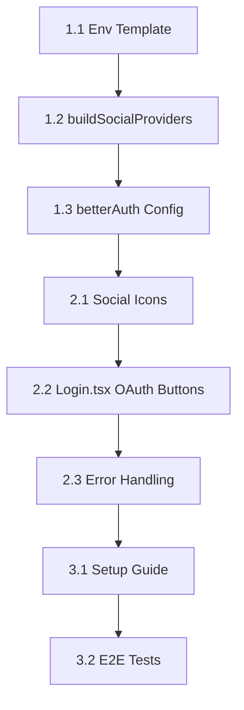

# Implementation Tasks: OAuth Social Login

**Change ID:** `add-oauth-social-login`
**Status:** `implemented`
**Planning Completed:** 2025-02-06

---

## Phase 1: Backend Implementation

### Task 1.1: Add Environment Variables Template ✅
**File:** `apps/server/.env.example`
**Action:** Append OAuth configuration template

```env
# OAuth Social Login (Phase 1)
# Get credentials from respective provider consoles
GOOGLE_CLIENT_ID=
GOOGLE_CLIENT_SECRET=
GITHUB_CLIENT_ID=
GITHUB_CLIENT_SECRET=
APPLE_CLIENT_ID=
APPLE_CLIENT_SECRET=
APPLE_TEAM_ID=
APPLE_KEY_ID=
```

**Verification:** File contains new env vars

---

### Task 1.2: Create buildSocialProviders Helper ✅
**File:** `apps/server/src/auth/auth.ts`
**Action:** Add helper function before `export const auth = betterAuth({...})`

```typescript
/**
 * Build socialProviders config from environment variables.
 * Only includes providers with complete credentials.
 */
function buildSocialProviders() {
    const providers: Record<string, object> = {};

    // Google
    if (process.env.GOOGLE_CLIENT_ID && process.env.GOOGLE_CLIENT_SECRET) {
        providers.google = {
            clientId: process.env.GOOGLE_CLIENT_ID,
            clientSecret: process.env.GOOGLE_CLIENT_SECRET,
        };
    }

    // GitHub
    if (process.env.GITHUB_CLIENT_ID && process.env.GITHUB_CLIENT_SECRET) {
        providers.github = {
            clientId: process.env.GITHUB_CLIENT_ID,
            clientSecret: process.env.GITHUB_CLIENT_SECRET,
        };
    }

    // Apple
    if (process.env.APPLE_CLIENT_ID && process.env.APPLE_CLIENT_SECRET) {
        providers.apple = {
            clientId: process.env.APPLE_CLIENT_ID,
            clientSecret: process.env.APPLE_CLIENT_SECRET,
            // Apple requires additional config
            ...(process.env.APPLE_TEAM_ID && { teamId: process.env.APPLE_TEAM_ID }),
            ...(process.env.APPLE_KEY_ID && { keyId: process.env.APPLE_KEY_ID }),
        };
    }

    // Log enabled providers (masked secrets)
    const enabledProviders = Object.keys(providers);
    if (enabledProviders.length > 0) {
        console.log('[Auth] Social providers enabled:', enabledProviders.join(', '));
    }

    return providers;
}
```

**Verification:** Function exists and logs enabled providers on startup

---

### Task 1.3: Add socialProviders to betterAuth Config ✅
**File:** `apps/server/src/auth/auth.ts`
**Action:** Add `socialProviders` and `account` config to betterAuth()

**Location:** After `emailAndPassword: {...}` block

```typescript
// Social OAuth providers (Phase 1: env-based config)
socialProviders: buildSocialProviders(),

// Account configuration for OAuth linking
account: {
    accountLinking: {
        enabled: true,
        trustedProviders: ['google', 'github', 'apple'],
    },
},
```

**Verification:** Server starts with social providers logged

---

## Phase 2: Frontend Implementation

### Task 2.1: Create Social Icons Component ✅
**File:** `apps/admin/src/components/icons/SocialIcons.tsx` (CREATE NEW)
**Action:** Create file with SVG icons

```tsx
import type { ComponentProps } from 'react';

type IconProps = ComponentProps<'svg'>;

export function GoogleIcon(props: IconProps) {
    return (
        <svg viewBox="0 0 256 262" xmlns="http://www.w3.org/2000/svg" {...props}>
            <path d="M255.878 133.451c0-10.734-.871-18.567-2.756-26.69H130.55v48.448h71.947c-1.45 12.04-9.283 30.172-26.69 42.356l-.244 1.622l38.755 30.023l2.685.268c24.659-22.774 38.875-56.282 38.875-96.027" fill="#4285f4"/>
            <path d="M130.55 261.1c35.248 0 64.839-11.605 86.453-31.622l-41.196-31.913c-11.024 7.688-25.82 13.055-45.257 13.055c-34.523 0-63.824-22.773-74.269-54.25l-1.531.13l-40.298 31.187l-.527 1.465C35.393 231.798 79.49 261.1 130.55 261.1" fill="#34a853"/>
            <path d="M56.281 156.37c-2.756-8.123-4.351-16.827-4.351-25.82c0-8.994 1.595-17.697 4.206-25.82l-.073-1.73L15.26 71.312l-1.335.635C5.077 89.644 0 109.517 0 130.55s5.077 40.905 13.925 58.602z" fill="#fbbc05"/>
            <path d="M130.55 50.479c24.514 0 41.05 10.589 50.479 19.438l36.844-35.974C195.245 12.91 165.798 0 130.55 0C79.49 0 35.393 29.301 13.925 71.947l42.211 32.783c10.59-31.477 39.891-54.251 74.414-54.251" fill="#eb4335"/>
        </svg>
    );
}

export function GitHubIcon(props: IconProps) {
    return (
        <svg viewBox="0 0 24 24" xmlns="http://www.w3.org/2000/svg" {...props}>
            <path d="M12 .297c-6.63 0-12 5.373-12 12c0 5.303 3.438 9.8 8.205 11.385c.6.113.82-.258.82-.577c0-.285-.01-1.04-.015-2.04c-3.338.724-4.042-1.61-4.042-1.61C4.422 18.07 3.633 17.7 3.633 17.7c-1.087-.744.084-.729.084-.729c1.205.084 1.838 1.236 1.838 1.236c1.07 1.835 2.809 1.305 3.495.998c.108-.776.417-1.305.76-1.605c-2.665-.3-5.466-1.332-5.466-5.93c0-1.31.465-2.38 1.235-3.22c-.135-.303-.54-1.523.105-3.176c0 0 1.005-.322 3.3 1.23c.96-.267 1.98-.399 3-.405c1.02.006 2.04.138 3 .405c2.28-1.552 3.285-1.23 3.285-1.23c.645 1.653.24 2.873.12 3.176c.765.84 1.23 1.91 1.23 3.22c0 4.61-2.805 5.625-5.475 5.92c.42.36.81 1.096.81 2.22c0 1.606-.015 2.896-.015 3.286c0 .315.21.69.825.57C20.565 22.092 24 17.592 24 12.297c0-6.627-5.373-12-12-12" fill="currentColor"/>
        </svg>
    );
}

export function AppleIcon(props: IconProps) {
    return (
        <svg viewBox="0 0 32 32" xmlns="http://www.w3.org/2000/svg" {...props}>
            <path d="M9.438 31.401a7 7 0 0 1-1.656-1.536a20 20 0 0 1-1.422-1.938a18.9 18.9 0 0 1-2.375-4.849c-.667-2-.99-3.917-.99-5.792c0-2.094.453-3.922 1.339-5.458a7.7 7.7 0 0 1 2.797-2.906a7.45 7.45 0 0 1 3.786-1.12q.705.002 1.51.198c.385.109.854.281 1.427.495c.729.281 1.13.453 1.266.495c.427.156.786.224 1.068.224c.214 0 .516-.068.859-.172c.193-.068.557-.188 1.078-.411c.516-.188.922-.349 1.245-.469c.495-.146.974-.281 1.401-.349a6.7 6.7 0 0 1 1.531-.063a9 9 0 0 1 2.589.557c1.359.547 2.458 1.401 3.276 2.615a6.4 6.4 0 0 0-.969.734a8.2 8.2 0 0 0-1.641 2.005a6.8 6.8 0 0 0-.859 3.359c.021 1.443.391 2.714 1.12 3.813a7.2 7.2 0 0 0 2.047 2.047c.417.281.776.474 1.12.604c-.161.5-.333.984-.536 1.464a19 19 0 0 1-1.667 3.083c-.578.839-1.031 1.464-1.375 1.88c-.536.635-1.052 1.12-1.573 1.458c-.573.38-1.25.583-1.938.583a4.4 4.4 0 0 1-1.38-.167c-.385-.13-.766-.271-1.141-.432a9 9 0 0 0-1.203-.453a6.3 6.3 0 0 0-3.099-.005c-.417.12-.818.26-1.214.432c-.557.234-.927.391-1.141.458c-.427.125-.87.203-1.318.229c-.693 0-1.339-.198-1.979-.599zm9.14-24.615c-.906.453-1.771.646-2.63.583c-.135-.865 0-1.75.359-2.719a7.3 7.3 0 0 1 1.333-2.24A7.1 7.1 0 0 1 19.812.733q1.319-.68 2.521-.734c.104.906 0 1.797-.333 2.76a8 8 0 0 1-1.333 2.344a6.8 6.8 0 0 1-2.115 1.682z" fill="currentColor"/>
        </svg>
    );
}
```

**Verification:** File created with three icon exports

---

### Task 2.2: Update Login.tsx with OAuth Buttons ✅
**File:** `apps/admin/src/pages/Login.tsx`
**Action:** Add OAuth buttons section

**Step 1:** Add imports at top
```tsx
import { signIn } from '../lib/auth-client';
import { GoogleIcon, GitHubIcon, AppleIcon } from '../components/icons/SocialIcons';
import { Button } from '@wordrhyme/ui';
```

**Step 2:** Add state for social loading
```tsx
const [socialLoading, setSocialLoading] = useState<string | null>(null);
```

**Step 3:** Add handleSocialLogin function
```tsx
const handleSocialLogin = async (provider: 'google' | 'github' | 'apple') => {
    setSocialLoading(provider);
    try {
        await signIn.social({ provider });
        // OAuth redirects to provider, no need to handle success here
    } catch (error) {
        console.error(`${provider} login failed:`, error);
        setSocialLoading(null);
    }
};
```

**Step 4:** Add OAuth buttons after email form, before "Don't have an account"
```tsx
{/* OAuth Separator */}
<div className="relative my-4">
    <div className="absolute inset-0 flex items-center">
        <div className="w-full border-t border-border" />
    </div>
    <div className="relative flex justify-center text-xs uppercase">
        <span className="bg-card px-2 text-muted-foreground">
            Or continue with
        </span>
    </div>
</div>

{/* OAuth Buttons */}
<div className="grid grid-cols-3 gap-2">
    <Button
        variant="outline"
        type="button"
        disabled={isLoading || !!socialLoading}
        onClick={() => handleSocialLogin('google')}
    >
        <GoogleIcon className="size-4" />
    </Button>
    <Button
        variant="outline"
        type="button"
        disabled={isLoading || !!socialLoading}
        onClick={() => handleSocialLogin('github')}
    >
        <GitHubIcon className="size-4" />
    </Button>
    <Button
        variant="outline"
        type="button"
        disabled={isLoading || !!socialLoading}
        onClick={() => handleSocialLogin('apple')}
    >
        <AppleIcon className="size-4" />
    </Button>
</div>
```

**Verification:** Login page shows 3 OAuth buttons

---

### Task 2.3: Add OAuth Error Handling ✅
**File:** `apps/admin/src/pages/Login.tsx`
**Action:** Add URL error parsing

**Step 1:** Add useEffect to parse OAuth errors
```tsx
import { useEffect } from 'react';
import { useSearchParams } from 'react-router-dom';
import { toast } from 'sonner';

// Inside component:
const [searchParams, setSearchParams] = useSearchParams();

useEffect(() => {
    const error = searchParams.get('error');
    if (error) {
        const errorMessages: Record<string, string> = {
            'OAuthAccountNotLinked': '此邮箱已使用其他方式注册，请使用邮箱密码登录',
            'AccessDenied': '登录已取消',
            'Configuration': 'OAuth 配置错误，请联系管理员',
        };
        toast.error(errorMessages[error] || `登录失败: ${error}`);
        // Clear error from URL
        setSearchParams({});
    }
}, [searchParams, setSearchParams]);
```

**Verification:** OAuth errors display as toast notifications

---

## Phase 3: Documentation & Testing

### Task 3.1: Create OAuth Setup Guide ✅
**File:** `docs/guides/oauth-setup.md` (CREATE NEW)
**Action:** Document setup steps for each provider

**Content outline:**
1. Google Cloud Console setup
2. GitHub OAuth App setup
3. Apple Developer setup
4. Callback URL configuration
5. Environment variable setup
6. Troubleshooting common errors

---

### Task 3.2: Add E2E Test Stubs ✅
**File:** `apps/admin/tests/e2e/oauth-login.spec.ts` (CREATE NEW)
**Action:** Create Playwright test stubs

```typescript
import { test, expect } from '@playwright/test';

test.describe('OAuth Social Login', () => {
    test('should display OAuth buttons on login page', async ({ page }) => {
        await page.goto('/login');
        await expect(page.getByRole('button', { name: /google/i })).toBeVisible();
        await expect(page.getByRole('button', { name: /github/i })).toBeVisible();
        await expect(page.getByRole('button', { name: /apple/i })).toBeVisible();
    });

    test('should disable buttons during loading', async ({ page }) => {
        await page.goto('/login');
        // Click Google button
        await page.getByRole('button', { name: /google/i }).click();
        // Verify all OAuth buttons are disabled
        await expect(page.getByRole('button', { name: /google/i })).toBeDisabled();
        await expect(page.getByRole('button', { name: /github/i })).toBeDisabled();
    });

    test('should show error toast for OAuth errors', async ({ page }) => {
        await page.goto('/login?error=AccessDenied');
        await expect(page.getByText('登录已取消')).toBeVisible();
    });
});
```

**Verification:** Tests pass (buttons visible, error handling works)

---

## Execution Order



---

## Exit Criteria

- [x] All tasks completed
- [x] Server starts with enabled providers logged
- [x] Login page displays OAuth buttons
- [x] OAuth flow redirects to provider
- [x] OAuth errors show toast notification
- [x] E2E tests pass
- [x] Documentation created
- [x] Multi-model review passed (Codex/Gemini)
