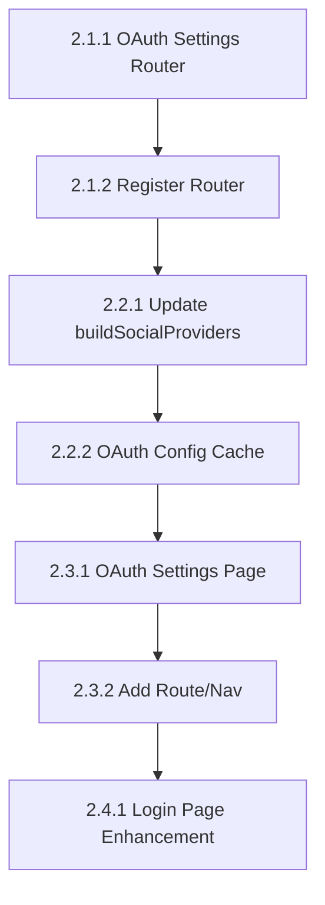

# Implementation Tasks: OAuth Admin Settings UI

**Change ID:** `oauth-admin-settings`
**Status:** `implemented`
**Planning Completed:** 2025-02-06

---

## Phase 2.1: Backend API

### Task 2.1.1: Create OAuth Settings Router ✅
**File:** `apps/server/src/trpc/routers/oauth-settings.ts` (CREATE NEW)
**Action:** Create tRPC router for OAuth settings management

```typescript
import { z } from 'zod';
import { router, protectedProcedure } from '../trpc';
import { TRPCError } from '@trpc/server';

const oauthProviderSchema = z.enum(['google', 'github', 'apple']);

export const oauthSettingsRouter = router({
    // List all providers with status
    list: protectedProcedure
        .meta({ permission: { action: 'manage', subject: 'Settings' } })
        .query(async ({ ctx }) => { ... }),

    // Get single provider config (secrets masked)
    get: protectedProcedure
        .meta({ permission: { action: 'manage', subject: 'Settings' } })
        .input(z.object({ provider: oauthProviderSchema }))
        .query(async ({ ctx, input }) => { ... }),

    // Update provider configuration
    set: protectedProcedure
        .meta({ permission: { action: 'manage', subject: 'Settings' } })
        .input(z.object({
            provider: oauthProviderSchema,
            enabled: z.boolean(),
            clientId: z.string().optional(),
            clientSecret: z.string().optional(),
            // Apple-specific
            teamId: z.string().optional(),
            keyId: z.string().optional(),
        }))
        .mutation(async ({ ctx, input }) => { ... }),

    // Get enabled providers (public for login page)
    getEnabledProviders: protectedProcedure
        .query(async ({ ctx }) => { ... }),
});
```

**Verification:** Router created and added to main router

---

### Task 2.1.2: Register OAuth Settings Router ✅
**File:** `apps/server/src/trpc/routers/index.ts`
**Action:** Add oauth-settings router to main router

```typescript
import { oauthSettingsRouter } from './oauth-settings';

export const appRouter = router({
    // ... existing routers
    oauthSettings: oauthSettingsRouter,
});
```

**Verification:** `trpc.oauthSettings.*` endpoints available

---

## Phase 2.2: Modify Provider Loading

### Task 2.2.1: Update buildSocialProviders
**File:** `apps/server/src/auth/auth.ts`
**Action:** Modify `buildSocialProviders()` to read from DB first

Key changes:
1. Make function async
2. Read settings from database using SettingsService
3. Fall back to environment variables if DB empty
4. Cache settings for performance (5 min TTL)
5. Log configuration source

**Note:** Since betterAuth config is synchronous, need to use a sync cache or initialize at startup.

**Verification:** Server logs show "OAuth config loaded from: database" or "OAuth config loaded from: environment"

---

### Task 2.2.2: Create OAuth Config Cache
**File:** `apps/server/src/auth/oauth-config-cache.ts` (CREATE NEW)
**Action:** Create cache service for OAuth settings

```typescript
interface OAuthConfigCache {
    providers: Record<string, object>;
    loadedAt: number;
    source: 'database' | 'environment';
}

let cache: OAuthConfigCache | null = null;
const CACHE_TTL = 5 * 60 * 1000; // 5 minutes

export async function getOAuthProviders(): Promise<Record<string, object>> { ... }
export async function invalidateOAuthCache(): Promise<void> { ... }
export function getOAuthProvidersSync(): Record<string, object> { ... }
```

**Verification:** Cache invalidation triggers reload on next request

---

## Phase 2.3: Admin UI

### Task 2.3.1: Create OAuth Settings Page ✅
**File:** `apps/admin/src/pages/OAuthSettings.tsx` (CREATE NEW)
**Action:** Create settings page for OAuth providers

Key components:
1. Provider cards (Google, GitHub, Apple)
2. Enable/disable toggle
3. Credential inputs (masked secrets)
4. Callback URL display (read-only)
5. Save button per provider
6. Loading states

**Verification:** Page renders with three provider cards

---

### Task 2.3.2: Add Route and Navigation ✅
**File:** `apps/admin/src/App.tsx`
**Action:** Add route for OAuth settings page

```typescript
import { OAuthSettingsPage } from './pages/OAuthSettings';

// In routes:
<Route path="platform/settings/oauth" element={<OAuthSettingsPage />} />
```

**File:** `apps/admin/src/components/nav-main.tsx` (or sidebar config)
**Action:** Add navigation item under Platform Settings

**Verification:** Navigate to `/platform/settings/oauth` shows page

---

## Phase 2.4: Login Page Enhancement

### Task 2.4.1: Fetch Enabled Providers ✅
**File:** `apps/admin/src/pages/Login.tsx`
**Action:** Fetch and display only enabled OAuth providers

```typescript
// Add query for enabled providers
const { data: enabledProviders } = trpc.oauthSettings.getEnabledProviders.useQuery();

// Render only enabled provider buttons
{enabledProviders?.includes('google') && (
    <Button onClick={() => handleSocialLogin('google')}>
        <GoogleIcon />
    </Button>
)}
```

**Verification:** Login page only shows enabled provider buttons

---

## Execution Order



---

## Exit Criteria

- [x] OAuth settings API endpoints working
- [x] Settings stored in database with encryption
- [x] Admin can configure providers via UI
- [x] Changes take effect without restart
- [x] Login page shows only enabled providers
- [x] Fallback to env vars when DB empty
